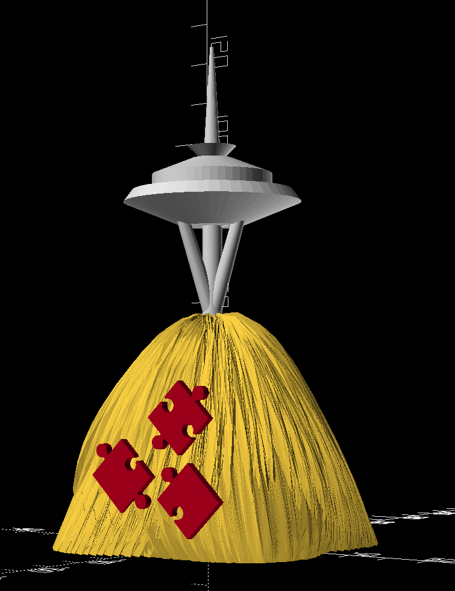
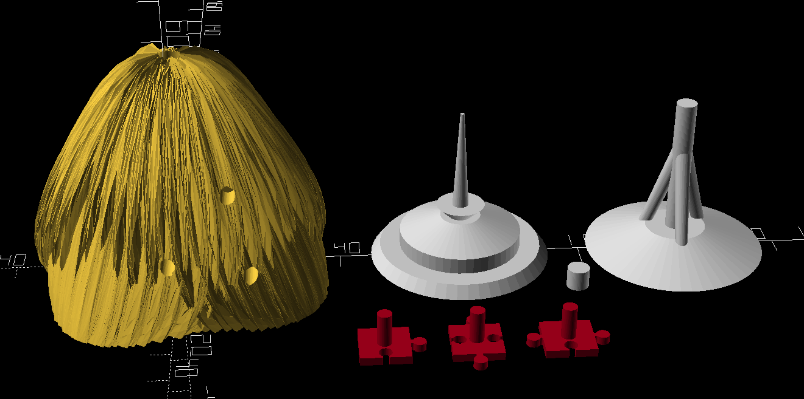

# 3D Printed Model

This contains a 3D-Printable Model based on the logo.

The [original haystack model](https://www.thingiverse.com/thing:3896602) was created by user mephistoschan of Thingiverse - see LICENSE.md for details.

TODO: Image of Printed Model

## Printing

1. The three files to print are `haystack.stl`, `tower.stl`, and `puzzle_pieces.stl`
2. The haystack has a number of fine details.  Printing thinner layers (such as 0.1mm) will result in a noticably smoother look at the cost of more printing time.  The model looks reasonable with layers as thick as 0.3mm, however.
3. The Tower has sufficient curves to benefit from a layer size of approximately 0.15mm, but also looks acceptable at 0.3mm.
4. There are no specific material requirements.  Both PLA and PETG have been used without issue.

## Assembly

1. The tower is printed in two halves and has a connecting peg for alignment.  After printing, the three pieces should be glued together (superglue works well).
2. The puzzle pieces and tower press into the haystack. Gluing is optional.
    * The fit for the tower is not sufficiently tight to invert the model, but for stationary situations it's sufficiently stable.
    * The fit for the puzzle pieces is tight enough to not require glue.
3. If the holes are too small, the stud holes on the side can we widened with a 9/64" drill bit (which will snugly fit the 3.5mm stud).  The hole for the tower pillar can be widened with a 13/64" drill bit to match the 5mm pillar (7/32 will have more slop and should be avoided if possible).
